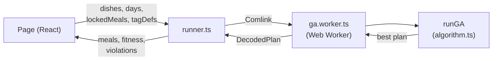
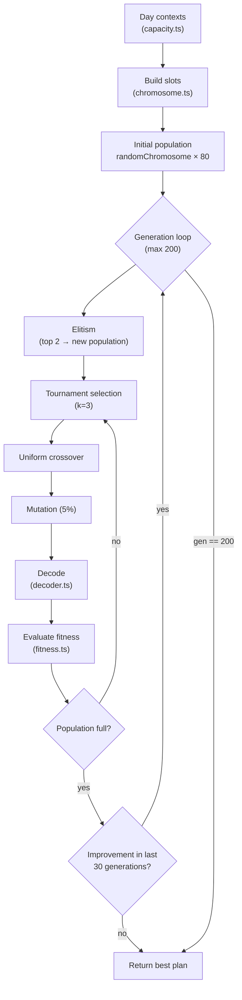
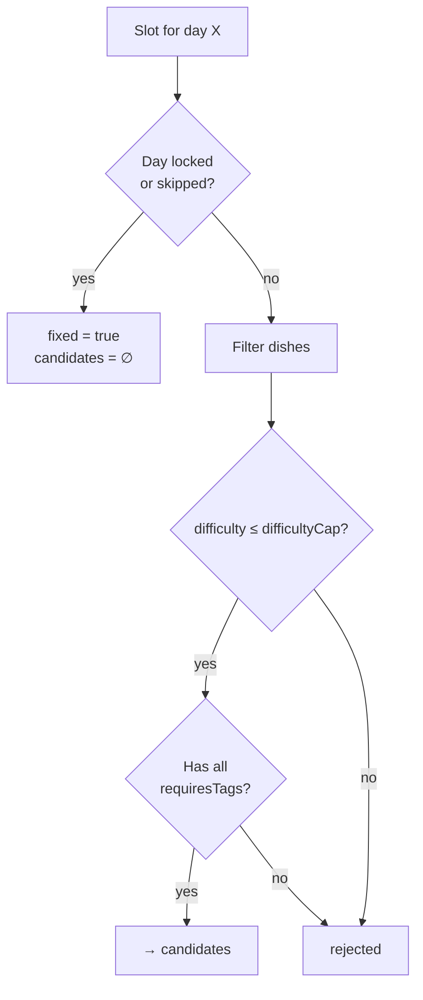
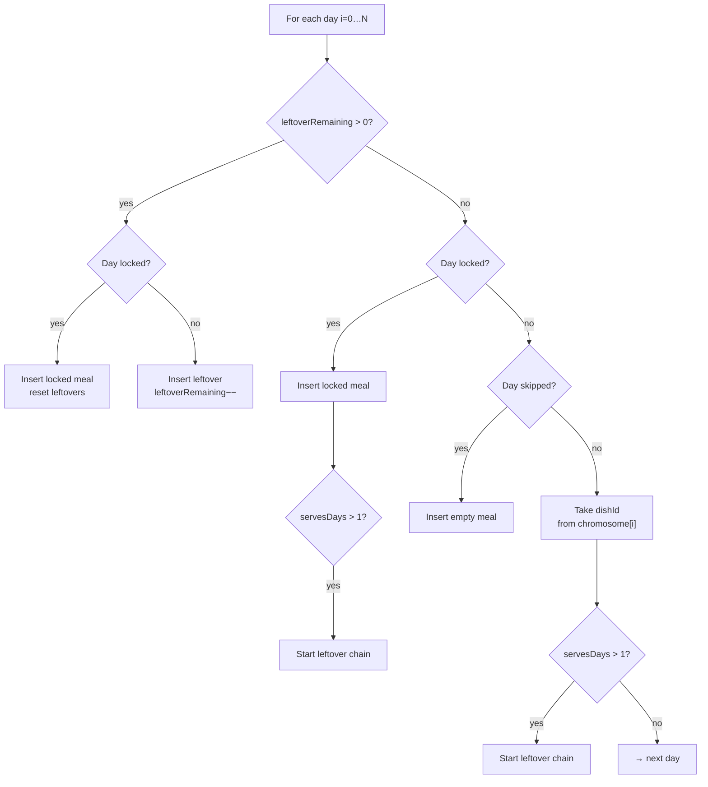
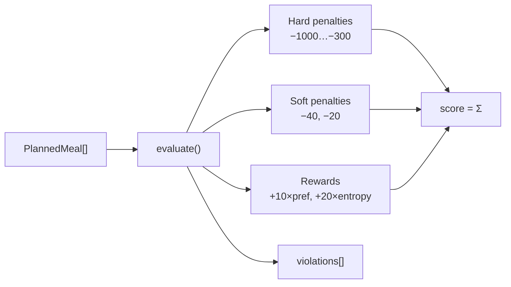
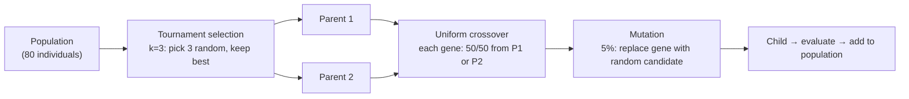
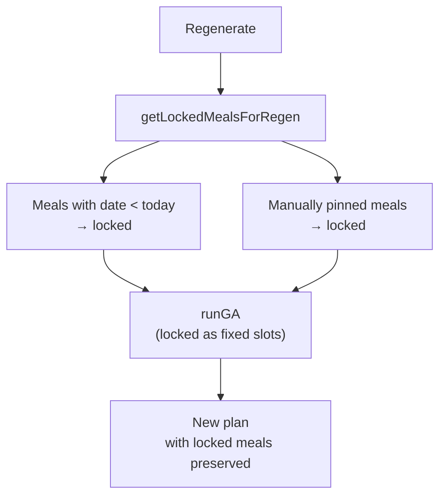
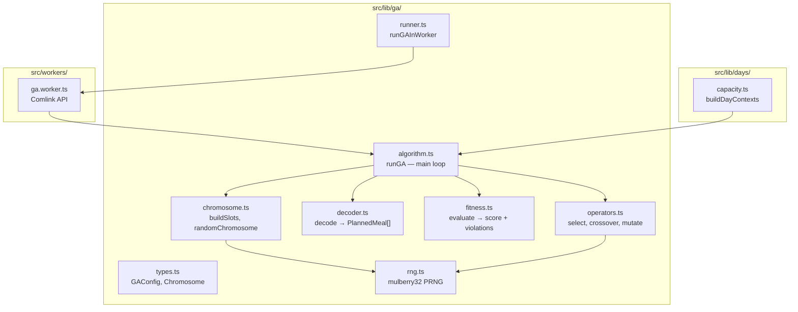

# Meal plan generation algorithm

## Overview

Meal plans are generated using a **genetic algorithm (GA)** running in a Web Worker (via Comlink) so it never blocks the UI. Input: dish library, day contexts (difficulty caps, required tags), optionally locked meals. Output: an optimized plan with a fitness score and a list of rule violations.

### High-level flow



---

## GA pipeline



---

## Step 1 — Day contexts (`src/lib/days/capacity.ts`)

A `DayContext` is computed for each day in the plan:

| Field | Description |
|---|---|
| `difficultyCap` | Base cap: **3** on weekdays, **5** on weekends. Overridden by a day modifier. Minimum: 1. |
| `isWeekend` | `true` for Saturday and Sunday |
| `skip` | Day is skipped (not cooking) |
| `requiresTags` | Tags that the dish must have on this day |

### Example

Plan Apr 19 – May 19, 2026 with modifiers:
- **Apr 23 (Wed):** `difficultyCap: 2` — nanny cooks, easy dish
- **Apr 30 (Wed):** `difficultyCap: 2` — same

```
Mon 21.04: cap=3  Tue 22.04: cap=3  Wed 23.04: cap=2  Thu 24.04: cap=3  Fri 25.04: cap=3
Sat 26.04: cap=5  Sun 27.04: cap=5  Mon 28.04: cap=3  Tue 29.04: cap=3  Wed 30.04: cap=2
```

---

## Step 2 — Slots and candidates (`src/lib/ga/chromosome.ts`)

Each plan day is a **slot**:



### Example: candidates for a day with `cap=2`

Out of 25 dishes in the library, **9** satisfy `difficulty ≤ 2`:

| Dish | Meat | Difficulty | Serves | Tags |
|---|---|---|---|---|
| Rosół (chicken broth) | poultry | 2 | 2 days | nanny |
| Paluszki rybne (fish sticks) | fish | 2 | 1 day | nanny |
| Pulpety w sosie koperkowym (meatballs) | pork | 1 | 2 days | — |
| Pizza zamawiana (takeout pizza) | none | 1 | 1 day | takeout |
| Pierogi z mięsem (store-bought pierogis) | pork | 1 | 1 day | — |
| Zamawianka (Papudajnia) | none | 1 | 1 day | takeout |
| Zupa kalafiorowa (cauliflower soup) | none | 2 | 2 days | — |
| Zupa pomidorowa (tomato soup) | poultry | 2 | 2 days | — |
| Kurczak z pieca (roast chicken) | poultry | 2 | 1 day | — |

On a weekend day with `cap=5`, all 25 dishes are available.

---

## Step 3 — Chromosome representation

A chromosome is an array `(string | null)[]` with one entry per plan day. Example for 6 days:

```
[  "curry-id",  null,     "soup-id",     null,     "cutlet-id",  "broth-id"  ]
     Apr 26      Apr 27      Apr 28       Apr 29      Apr 30       May 01
   (curry,2d)  (leftover)  (soup,2d)    (leftover)  (cutlet)     (broth,2d)
```

Genes at leftover positions (Apr 27, Apr 29) are ignored by the decoder — those days are filled by the leftover mechanism.

---

## Step 4 — Decoding (`src/lib/ga/decoder.ts`)

A chromosome is converted to a `PlannedMeal[]` list:



### Decoding example

```
Apr 26 → chromosome: "curry-id"     → Curry z kurczakiem (poultry, servesDays=2)
Apr 27 → leftoverRemaining=1        → Curry z kurczakiem (leftover)
Apr 28 → chromosome: "tomato-soup"  → Zupa pomidorowa (poultry, servesDays=2)
Apr 29 → leftoverRemaining=1        → Zupa pomidorowa (leftover)
Apr 30 → chromosome: "cutlet-id"    → Kotlet schabowy (pork, servesDays=1)
May 01 → chromosome: "broth-id"     → Rosół (poultry, servesDays=2)
May 02 → leftoverRemaining=1        → Rosół (leftover)
```

---

## Step 5 — Fitness evaluation (`src/lib/ga/fitness.ts`)

Each decoded plan receives a score that is the sum of rewards and penalties:

### Hard penalties (large negative values)

| Rule | Penalty | Violation kind |
|---|---|---|
| Same meat two consecutive days | −1000 | `same_meat` |
| Dish difficulty > day cap | −500 | `difficulty_overrun` |
| Missing required tag | −800 | `tag_required` |
| Tag exceeds `maxPerWeek` | −300 × excess | `tag_week_limit` |
| Tag appears too soon (`minGapDays`) | −400 | `tag_gap` |
| Cumulative difficulty in range > limit | −600 × excess | `cumulative_limit` |

### Soft penalties

| Rule | Penalty |
|---|---|
| Dish repeat | −40 × number of prior occurrences |
| Hard dish (≥4) on weekday | −20 |

### Rewards

| Rule | Reward |
|---|---|
| Dish preference (1–5) | +10 × preference |
| Meat diversity (Shannon entropy) | +20 × entropy |

### Evaluation flow



### Scoring example

Decoded plan from the example above (Apr 26 – May 02):

```
Apr 26: Curry z kurczakiem (poultry, pref=4, diff=3) → +40 pref
Apr 27: Curry z kurczakiem (leftover)                 → prevMeat=poultry
Apr 28: Zupa pomidorowa (poultry, pref=3, diff=2)     → −1000 same_meat! (poultry after poultry)
                                                         +30 pref
Apr 29: Zupa pomidorowa (leftover)                    → prevMeat=poultry
Apr 30: Kotlet schabowy (pork, pref=5, diff=3)        → +50 pref, OK (pork ≠ poultry)
May 01: Rosół (poultry, pref=4, diff=2)               → +40 pref, OK (poultry ≠ pork)
```

The GA evolves the population to avoid such penalties — e.g. inserting a non-poultry dish between curry and tomato soup.

> **Note:** `prevMeat` is updated after leftover days too, so leftover meat type affects the next day's constraint.

---

## Step 6 — Genetic operators (`src/lib/ga/operators.ts`)



### Default parameters

| Parameter | Value |
|---|---|
| `populationSize` | 80 |
| `generations` | 200 |
| `mutationRate` | 0.05 (5%) |
| `eliteCount` | 2 |
| `tournamentK` | 3 |
| `earlyStopGenerations` | 30 |

---

## Step 7 — Plan regeneration

When clicking "Regenerate" on the plan detail page:



### Regeneration example (today = Apr 25, 2026)

Plan Apr 19 – May 19 has 31 days. After clicking "Regenerate":
- **Apr 19–24** (6 days) → locked (in the past)
- **Apr 25**: leftover from Apr 24's Gulasz wieprzowy (automatically inserted by decoder)
- **Apr 26 – May 19** (24 days) → GA generates from scratch

If the user manually pinned Rosół on May 01, that day stays fixed regardless of date.

---

## Tag rules

Tags define per-week and minimum-gap constraints:

| Tag | Example dishes | `maxPerWeek` | `minGapDays` |
|---|---|---|---|
| **niania** (nanny) | Rosół, Paluszki rybne, Pizza domowa, Naleśniki | 2 | — |
| **zamawiane** (takeout) | Pizza zamawiana, Zamawianka (Papudajnia) | 1 | 14 |
| **smażone** (fried) | Kotlet schabowy, Naleśniki, Pyszne trójkąciki | — | — |

The GA penalizes plans that break these limits — e.g. 3 nanny meals in one week (penalty −300) or takeout pizza twice within 10 days instead of the required 14 (penalty −400).

---

## PRNG seed

The algorithm uses **mulberry32** — a fast 32-bit PRNG. The seed is randomized on each run (`Math.random()`), ensuring different results on successive regenerations.

---

## Code architecture


